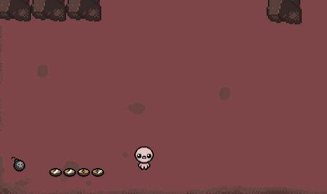

# Isaac

But in javascript!

## Introduction

I **love** Isaac game (go grab it [http://store.steampowered.com/app/250900/](here)), and I love Javascript.

I wanted to experience a bit canvas development so I decided to build this clone, the playable latest version is _always_ available here: [http://nicolasbrugneaux.github.io/isaac.js/](http://nicolasbrugneaux.github.io/isaac.js/).

The idea that I tried to replicate is a bit like the React ideas, I basically re-render everything every animationFrame. The state of each componenent is stored and represented when rendered. It doesn't use fancy diffs or anything as canvas is **so** fast. But maybe later, some webworkers, diffs, etc.. might appear, not necessarily out of need but maybe out of curiosity.

## Goals

Well.. a playable version of Isaac, of course it won't be as good because I just don't have enough time to put into this and the original is just amazing.

So no real roadmap for now. :kissing_smiling_eyes:

## Contribute

You'll need node and npm for the development.

- `npm install`
- `npm start # compiles and watches`
- there's a gulp serve task you can use to serve it or just open `index.html` in your favorite browser.
If you encounter any 404 on new pictures, they might be caused by missing read rights.

_Made with :heart: on my free time._

## License

The MIT License (MIT)

Copyright (c) 2015 Nicolas Brugneaux <nicolas.brugneaux@gmail.com>

Permission is hereby granted, free of charge, to any person obtaining a copy
of this software and associated documentation files (the "Software"), to deal
in the Software without restriction, including without limitation the rights
to use, copy, modify, merge, publish, distribute, sublicense, and/or sell
copies of the Software, and to permit persons to whom the Software is
furnished to do so, subject to the following conditions:

The above copyright notice and this permission notice shall be included in
all copies or substantial portions of the Software.

THE SOFTWARE IS PROVIDED "AS IS", WITHOUT WARRANTY OF ANY KIND, EXPRESS OR
IMPLIED, INCLUDING BUT NOT LIMITED TO THE WARRANTIES OF MERCHANTABILITY,
FITNESS FOR A PARTICULAR PURPOSE AND NONINFRINGEMENT. IN NO EVENT SHALL THE
AUTHORS OR COPYRIGHT HOLDERS BE LIABLE FOR ANY CLAIM, DAMAGES OR OTHER
LIABILITY, WHETHER IN AN ACTION OF CONTRACT, TORT OR OTHERWISE, ARISING FROM,
OUT OF OR IN CONNECTION WITH THE SOFTWARE OR THE USE OR OTHER DEALINGS IN
THE SOFTWARE.
